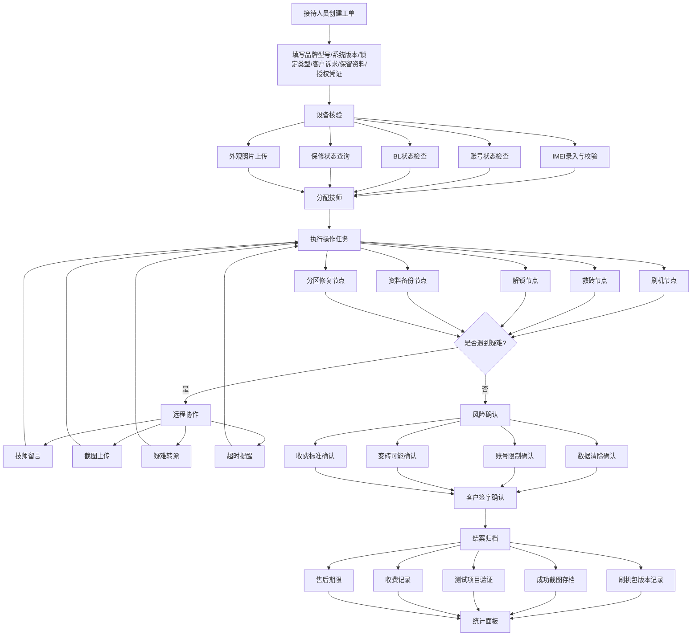

## 1. 产品概述

安卓刷机解锁工单平台是为连锁维修团队、售后外包小组和远程技术支持人员打造的专业合规工单管理系统。平台将刷机、解锁、救砖等高风险操作流程标准化，通过工单全生命周期管理确保操作可追溯、风险有确认、结果可归档。

- 解决行业痛点：刷机解锁操作缺乏标准化流程管控，风险告知不充分，责任边界模糊
- 目标用户：连锁维修门店接待/技师、售后外包团队、远程技术支持工程师
- 核心价值：流程合规化、操作可追溯、风险可控、数据可统计

## 2. 核心功能

### 2.1 用户角色

| 角色 | 注册方式 | 核心权限 |
|------|----------|----------|
| 接待人员 | 管理员分配 | 创建工单、填写客户信息、设备登记 |
| 技师 | 管理员分配 | 执行操作任务、远程协作、上传截图 |
| 远程专家 | 管理员分配 | 疑难转派处理、远程指导、审核确认 |
| 管理员 | 系统预设 | 全部权限、数据统计、人员管理 |

### 2.2 功能模块

1. **工单大厅**：工单列表、创建工单、状态筛选、工单详情入口
2. **设备核验**：IMEI录入、账号状态、BL状态、保修状态、外观照片
3. **操作任务**：刷机/救砖/解锁/备份/修复步骤节点、勾选执行、结果填写
4. **远程协作**：技师留言、截图上传、疑难转派、超时提醒
5. **风险确认**：数据清除确认、账号限制确认、变砖可能确认、收费标准确认
6. **结案档案**：刷机包版本、成功截图、测试项目、收费记录、售后期限、品牌成功率统计

### 2.3 页面详情

| 页面名称 | 模块名称 | 功能描述 |
|----------|----------|----------|
| 工单大厅 | 工单列表 | 按状态/品牌/日期筛选工单，显示工单号、品牌型号、状态、创建时间 |
| 工单大厅 | 创建工单 | 填写品牌型号、系统版本、锁定类型、客户诉求、是否保留资料、授权凭证 |
| 工单大厅 | 状态看板 | 统计各状态工单数量，快捷筛选 |
| 设备核验 | IMEI录入 | 双IMEI输入与校验，自动比对历史记录 |
| 设备核验 | 账号状态 | 账号锁/FRP状态、关联账号信息 |
| 设备核验 | BL状态 | Bootloader锁定状态、解锁难度评估 |
| 设备核验 | 保修状态 | 保修查询结果、是否影响保修提示 |
| 设备核验 | 外观照片 | 设备外观拍照上传，支持标注损伤位置 |
| 操作任务 | 任务节点 | 刷机/救砖/解锁/备份/修复步骤可勾选节点 |
| 操作任务 | 结果记录 | 每个节点执行结果、耗时、异常描述 |
| 操作任务 | 进度追踪 | 整体进度条、当前步骤高亮 |
| 远程协作 | 留言板 | 技师与远程专家实时留言沟通 |
| 远程协作 | 截图上传 | 操作过程截图上传与标注 |
| 远程协作 | 疑难转派 | 转派至高级技师或远程专家，附转派原因 |
| 远程协作 | 超时提醒 | 操作超时自动提醒，可配置超时阈值 |
| 风险确认 | 数据清除 | 数据清除风险说明与客户签名确认 |
| 风险确认 | 账号限制 | 账号功能限制风险说明与确认 |
| 风险确认 | 变砖可能 | 变砖风险等级评估与客户确认 |
| 风险确认 | 收费标准 | 收费项目明细与客户签字 |
| 结案档案 | 刷机记录 | 刷机包版本、工具版本、操作日志 |
| 结案档案 | 成功截图 | 操作成功后系统信息截图 |
| 结案档案 | 测试项目 | 功能测试清单与逐项验证结果 |
| 结案档案 | 收费记录 | 实际收费金额、支付方式、票据信息 |
| 结案档案 | 售后期限 | 保修期限设定、售后承诺说明 |
| 结案档案 | 统计面板 | 各品牌成功率、平均处理时长、高风险机型排行 |

## 3. 核心流程

用户（接待人员）创建工单 → 录入设备信息与客户诉求 → 设备核验（IMEI/账号/BL/保修/外观）→ 分配技师执行操作任务 → 按节点执行刷机/解锁步骤并记录结果 → 如遇疑难则远程协作（留言/转派/超时提醒）→ 操作完成后风险确认（客户签字）→ 结案归档（记录刷机版本/截图/测试/收费/售后）→ 统计分析

## 4. 用户界面设计

### 4.1 设计风格

- **整体调性**：专业合规、工业严谨、值得信赖
- **主色调**：深钢蓝（#1B2A4A）为主色，传达专业与可信赖感
- **辅助色**：琥珀橙（#E8913A）作为警示/强调色，浅灰蓝（#F0F4F8）为背景色
- **按钮风格**：圆角4px，主按钮深钢蓝底白字，危险操作用红色系
- **字体**：标题用 Noto Sans SC Bold，正文用 Noto Sans SC Regular，代码/编号用 JetBrains Mono
- **布局风格**：左侧固定导航 + 右侧内容区，卡片式布局，表格为主的信息密度
- **图标风格**：线性图标（Lucide），24px，与文字配合使用
- **状态标识**：绿色=完成、蓝色=进行中、橙色=待处理、红色=异常/超时

### 4.2 页面设计概览

| 页面名称 | 模块名称 | UI 元素 |
|----------|----------|---------|
| 工单大厅 | 状态看板 | 顶部4色统计卡片（待处理/进行中/已完成/异常），数字大号加粗 |
| 工单大厅 | 工单列表 | 表格布局，行间分隔，状态标签彩色，品牌型号突出显示 |
| 工单大厅 | 创建工单 | 模态弹窗，表单分组（设备信息/客户信息/授权信息），必填项星标 |
| 设备核验 | IMEI录入 | 双列输入框，校验图标实时反馈，历史匹配提示 |
| 设备核验 | 状态检查 | 卡片组布局，每个状态项独立卡片，图标+文字+状态值 |
| 设备核验 | 外观照片 | 网格上传区域，拖拽上传，缩略图预览 |
| 操作任务 | 任务节点 | 垂直时间轴布局，节点圆形图标，已完成节点勾选，当前节点高亮 |
| 操作任务 | 结果记录 | 展开式面板，每个节点点击展开填写结果 |
| 操作任务 | 进度追踪 | 顶部进度条，百分比+步骤数 |
| 远程协作 | 留言板 | 聊天气泡式布局，区分技师/专家消息 |
| 远程协作 | 截图上传 | 内联上传区域，缩略图预览+标注 |
| 远程协作 | 疑难转派 | 转派按钮+弹窗选择接收人+原因文本框 |
| 远程协作 | 超时提醒 | 顶部通知横幅，橙色脉冲动画 |
| 风险确认 | 确认列表 | 卡片式风险项，每项包含说明文字+复选框+签名区域 |
| 风险确认 | 客户签字 | 底部签名画板，手写签名+日期自动填充 |
| 结案档案 | 记录详情 | 分组信息卡片，标签式信息展示 |
| 结案档案 | 统计面板 | 数据表格+柱状图/饼图，品牌成功率排行 |

### 4.3 响应式设计

- 桌面优先设计，1920px/1440px/1280px 三档适配
- 平板端（768px-1024px）侧边导航收窄为图标模式
- 移动端（<768px）底部Tab导航，表格转为卡片列表

### 4.4 3D 场景指导

不适用
