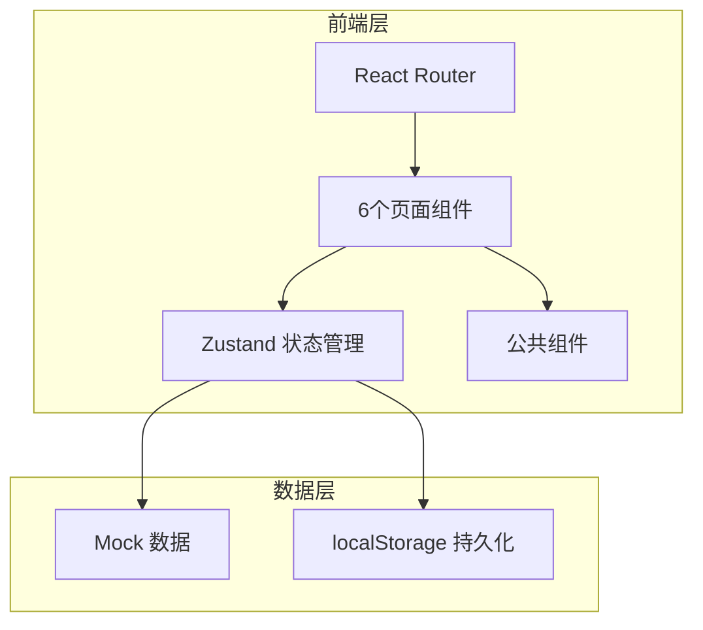
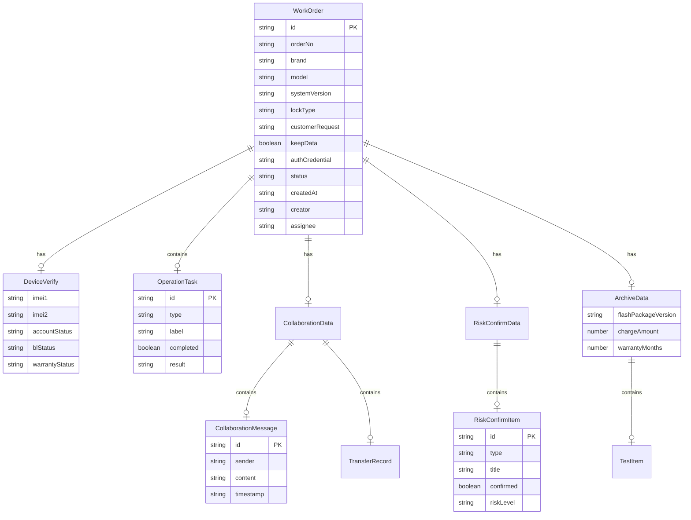

## 1. 架构设计



## 2. 技术说明

- **前端**：React@18 + TypeScript + Tailwind CSS@3 + Vite
- **初始化工具**：vite-init (react-ts 模板)
- **后端**：无（纯前端项目，使用 Mock 数据）
- **数据库**：localStorage 持久化 + 内存 Mock 数据
- **状态管理**：Zustand
- **路由**：react-router-dom v6
- **图标**：lucide-react

## 3. 路由定义

| 路由 | 用途 |
|------|------|
| `/` | 工单大厅 - 工单列表与创建入口 |
| `/verify/:id` | 设备核验 - 设备信息录入与校验 |
| `/tasks/:id` | 操作任务 - 执行步骤节点与结果记录 |
| `/collab/:id` | 远程协作 - 留言/截图/转派/超时提醒 |
| `/risk/:id` | 风险确认 - 风险告知与客户签字 |
| `/archive/:id` | 结案档案 - 归档记录与统计面板 |

## 4. API 定义

纯前端项目，无后端 API。数据通过 Zustand store 管理，使用 localStorage 持久化。

### 4.1 数据类型定义

```typescript
type OrderStatus = "pending" | "verifying" | "processing" | "collaborating" | "confirming" | "completed" | "abnormal"

type LockType = "pattern" | "pin" | "password" | "frp" | "bl" | "mi_account" | "huawei_account" | "samsung_account"

interface WorkOrder {
  id: string
  orderNo: string
  brand: string
  model: string
  systemVersion: string
  lockType: LockType
  customerRequest: string
  keepData: boolean
  authCredential: string
  status: OrderStatus
  createdAt: string
  updatedAt: string
  creator: string
  assignee: string
  verify: DeviceVerify
  tasks: OperationTask[]
  collaboration: CollaborationData
  riskConfirm: RiskConfirmData
  archive: ArchiveData
}

interface DeviceVerify {
  imei1: string
  imei2: string
  accountStatus: "locked" | "unlocked" | "frp_locked" | "unknown"
  accountInfo: string
  blStatus: "locked" | "unlocked" | "unlockable" | "unknown"
  blDifficulty: "easy" | "medium" | "hard" | "unknown"
  warrantyStatus: "in_warranty" | "out_of_warranty" | "unknown"
  warrantyNote: string
  photos: string[]
}

interface OperationTask {
  id: string
  type: "flash" | "unbrick" | "unlock" | "backup" | "repair" | "other"
  label: string
  completed: boolean
  result: string
  duration: number
  error: string
}

interface CollaborationMessage {
  id: string
  sender: string
  senderRole: string
  content: string
  timestamp: string
  type: "text" | "image" | "system"
}

interface TransferRecord {
  id: string
  from: string
  to: string
  reason: string
  timestamp: string
}

interface CollaborationData {
  messages: CollaborationMessage[]
  transfers: TransferRecord[]
  timeoutMinutes: number
  lastTimeoutAlert: string | null
}

interface RiskConfirmItem {
  id: string
  type: "data_clear" | "account_limit" | "brick_risk" | "charge_standard"
  title: string
  description: string
  confirmed: boolean
  riskLevel: "low" | "medium" | "high"
}

interface RiskConfirmData {
  items: RiskConfirmItem[]
  customerSignature: string
  confirmedAt: string | null
}

interface ArchiveData {
  flashPackageVersion: string
  toolVersion: string
  successScreenshots: string[]
  testItems: { name: string; passed: boolean }[]
  chargeAmount: number
  paymentMethod: string
  receiptInfo: string
  warrantyMonths: number
  warrantyNote: string
  completedAt: string | null
}

interface BrandStats {
  brand: string
  totalOrders: number
  successOrders: number
  successRate: number
  avgDuration: number
  highRiskModels: string[]
}
```

## 5. 服务器架构图

不适用（纯前端项目）

## 6. 数据模型

### 6.1 数据模型定义



### 6.2 数据定义语言

使用 localStorage 存储，键名定义：

- `flashforge_orders`：工单列表 JSON
- `flashforge_stats`：品牌统计 JSON
- `flashforge_settings`：系统配置 JSON

初始 Mock 数据包含 8 条示例工单，覆盖各状态和主流品牌（华为、小米、三星、OPPO、vivo、一加等）。
